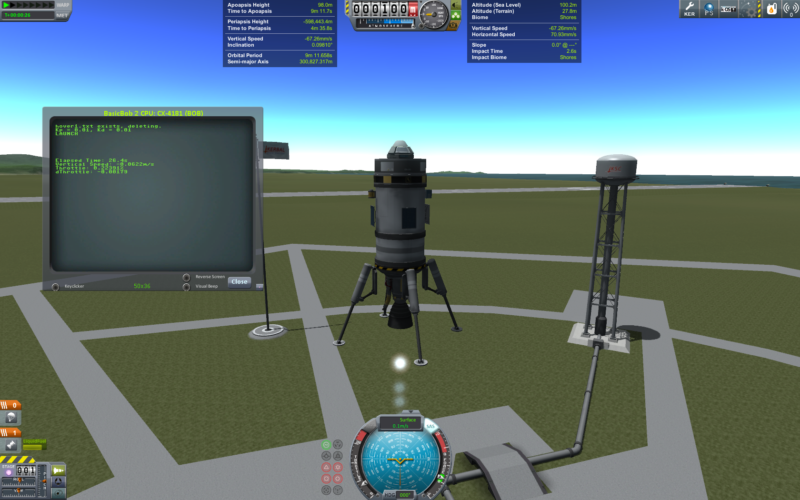

# KSP-rocket-hover-controller
Using the kOS mod to programmatically control a KSP rocket and build a PID controller to make the craft hover.

View a static rendition of the [KSP Hover Controller IPython Notebook](KSP_pid_tuning.ipynb) or [here](http://nbviewer.ipython.org/github/Elucidation/KSP-rocket-hover-controller/blob/master/KSP_pid_tuning.ipynb)
